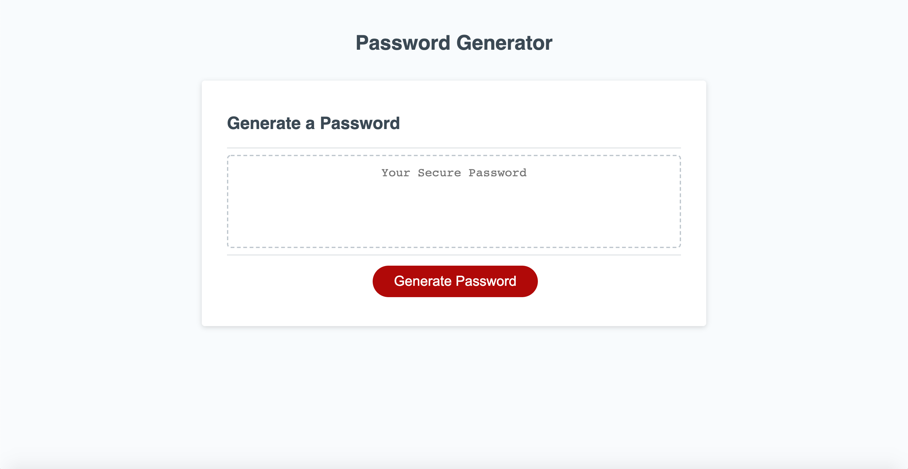

# Password Generator

This is a website designed to generate a secure password.  The password is randomly generated based on user input and will be between 8 and 128 chracters long.  The password can include upper case letters, lower case letters, numbers, and special characters depending on what the user selects for their password criteria.  

View the project live at this URL  https://markmulligan97.github.io/passwordGenerator/

